#  Week 2 Lab Report
## Installing VS Code
1. Go to the [Visual Studio Code](https://code.visualstudio.com/) Website
2. Follow the instructions to downloand and install. Make sure to choose the version for your OS

After installing, you should be able to open a window that looks like so:
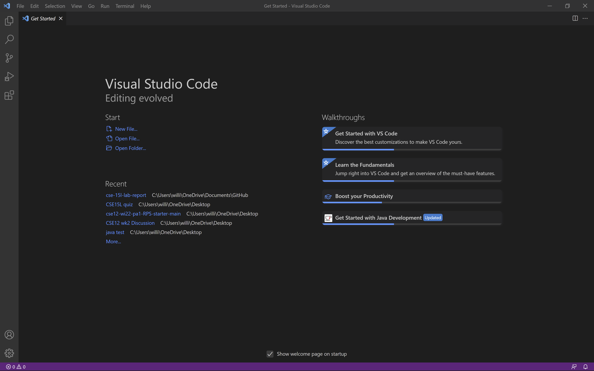

---
## Remotely Connecting
1. Open Settings > Apps > Apps & Features > Optional Features and scan if OpenSSH is already installed. If not, [install OpenSH](https://docs.microsoft.com/en-us/windows-server/administration/openssh/openssh_install_firstuse)
2. [Find your course-specific account for the class](https://sdacs.ucsd.edu/~icc/index.php)
3. To begin connecting to our remote host, open VS Code > Terminal > New Terminal (creating a terminal) and enter the command (replace `zz` with your course specific account):

 `ssh cs15lwi22zz@ieng6.ucsd.edu`

4. When a message pops up asking to continue, type and enter `yes`
5. Enter your password when asked (you will not see any placeholders)

After doing so, you should see a message like so:

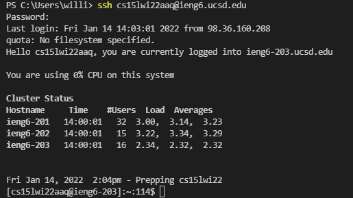

---
## Trying Some Commands

Go ahead and try out some commands!
* `ls -h` : lists human readable files
* `cat <file name> `: prints out contents within that file
* `cd <directory>` : changes directories

Since I have files in the server under my course account, I can do something like this!

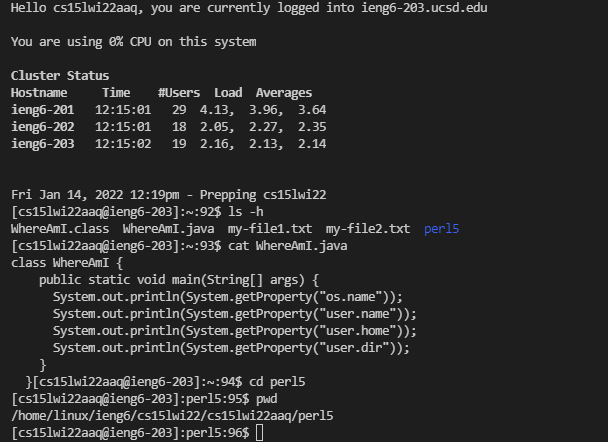

To log yourself out of the servier, use:

* Type `exit` in the terminal

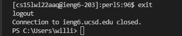

---
## Moving Files with `scp`
1. Create a file called `WhereAmI.java` in your VS Code
2. Copy and Paste the following:

``` 
class WhereAmI {
  public static void main(String[] args) {
    System.out.println(System.getProperty("os.name"));
    System.out.println(System.getProperty("user.name"));
    System.out.println(System.getProperty("user.home"));
    System.out.println(System.getProperty("user.dir"));
  }
}
```
3. Save and run the file using `javac WhereAmI.java` followed by `java WhereAmI`

As we run this program locally (on our computer), we should see the name of our OS, username, home, and directory of this file.

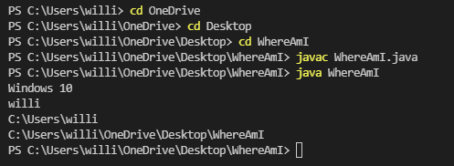

4. Now from the directory where this file is made, enter the command `scp WhereAmI.java cs15lwi22zz@ieng6.ucsd.edu:~/` (remember to change the `zz`) and login

You have now `scp`(secure copied) this file onto the host.

5. Use the `ls -h` command and you can see that the file has been copied onto the home directoy
6. Use the same `javac` and `java` commands

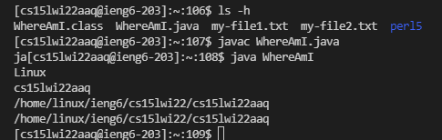

As you can see, what's printed is the program running on the server, thus it is different than when we ran it on our client.

---
## Setting an SSH Key
Inputting your password everytime you login to a remote server can be annoying. Thus, we can copy files on our local client and onto the server to recognize our login to remove the need of typing our password.
1. Open up your command prompt and enter `ssh-keygen`
2. Save it under  `/Users/willi/.ssh/id_rsa` be sure to replace `willi` with your username
3. Leave the passphrase empty (press enter)

You should now see this:

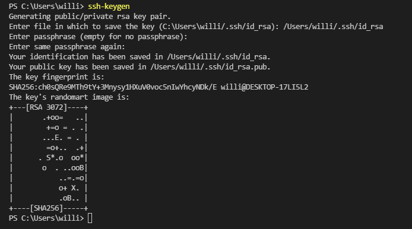

4. If you are on Windows, follow these [ssh-add](https://docs.microsoft.com/en-us/windows-server/administration/openssh/openssh_keymanagement#user-key-generation) steps


5. Connect with the remote host and use the command `mkdir .ssh` then `exit`
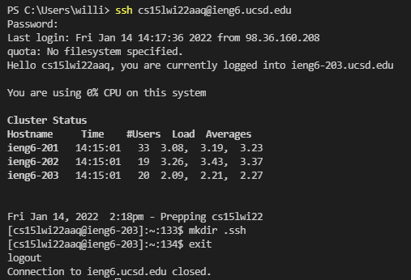

6. On your client use the command `scp /Users/willi/.ssh/id_rsa.pub cs15lwi22zz@ieng6.ucsd.edu:~/.ssh/authorized_keys` (replace `willi` with your username and `zz` with your account).
7. Enter your password and now you can connect w/o inputting your password!

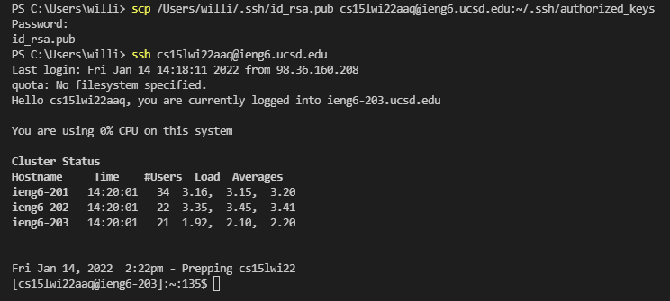

---
## Optimizing Remote Running
Setting an SSH key is one prime example of making remote running more effecient and cutting down repetitive tasks. Here are some other tricks to further eliminate repetition.

1. If we just exited our remote host, we can use the `up arrow key` to look for previous commands. This is so that we don't have to keep typing out that command or even copy/paste
2. We can even run commands at the end of an `ssh` by wrapping it in `quotations`.


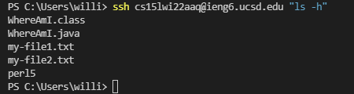


3. With this in mind, we can also use `;` to run multiple commands

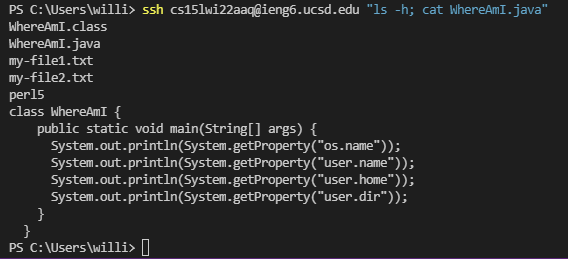

4. **Check this out!** After editing and saving the WhereAmI.java file, we are able to copy, compile, and execute our updated program onto the remote server with just 6 keystrokes!

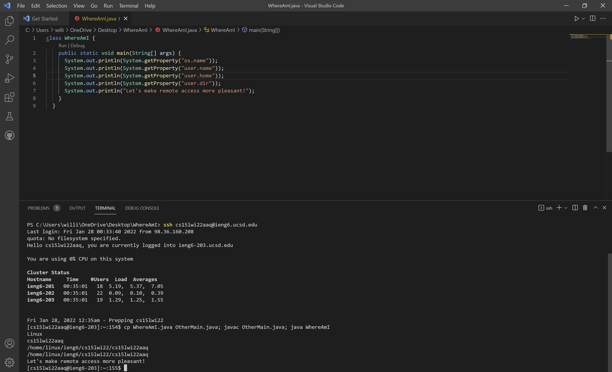

> Up-Arrow + Enter = 2 (ssh connect to remote server)
> Select + Ctrl+C + Ctrl+V + Enter = 6 (Copy, Paste, and Run command: `cp WhereAmI.java OtherMain.java; javac OtherMain.java; java WhereAmI`
