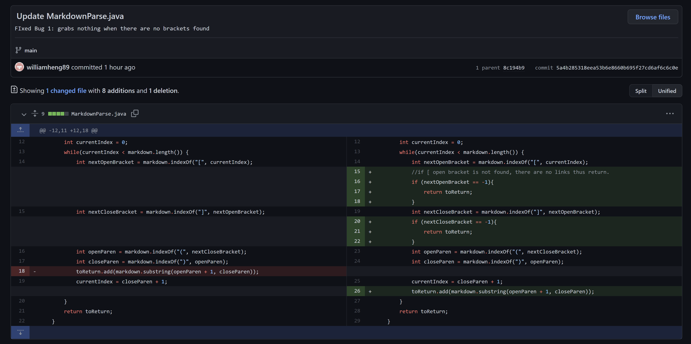

# Week 4 Lab Report
## Incremental Programming and Debugging

> Problem #1

[Test file - failure inducing output](https://github.com/williamheng89/markdown-parse/blob/main/lab3_bugged1.md)

[The Symptom](https://github.com/williamheng89/markdown-parse/commit/9114b45e91e3911ba5625fab444d3d214b133d71)

The **bug** was that my program grabbed and added any content between parenthesis. My program did not know to not grab contents betwen parenthesis if brackets were not found. As a result, the **symptons** were that unwanted elements were added into our ArrayList of URLs. 

---

> Problem #2

[Test file - failure inducing output](https://github.com/williamheng89/markdown-parse/blob/main/lab3_bug2.md)

[The Symptom](https://github.com/williamheng89/markdown-parse/commit/40868d70f2fa5bd05bb8a7e7174409379e0f2289)

The **bug** was that my program was trying to grab and add content between nonexistent parenthesis. As a result, the **symptoms** were that an IndexOutOfBoundsException error occured.

---

> Problem #3

[Test file - failure inducing output](https://github.com/williamheng89/markdown-parse/blob/main/lab3_bug3.md)

[The Symptom](https://github.com/williamheng89/markdown-parse/commit/8c194b9497fa2242202d44e919532754a113c244)

The **bug** was that my program did not know how to differentiate between an image and a URL, as they have similar markdown syntaxes. As a result, the **symptoms** were that unwanted elements were added to our ArrayList of URLs. 
